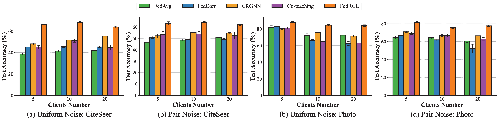

# FedRGL  

🔴 **Experimental Figure Correction**  

**Dear** chief editor and reviewer, due to our negligence, there are wrong pictures used in Figure 5 of the experimental part of the manuscript submitted. We sincerely apologize for our mistake and your misunderstanding of this part. The correct experimental diagram of Figure 5 is as follows:

  

**Figure:** Comparison of Prediction Accuracy Between FedRGL and Baselines on CiteSeer and Photo Datasets with Noise Rate of 0.3 Under Two Noise Types and Different Numbers of Clients.

## 1. Requirements

```python
torch==1.12.1
torch-cluster==1.6.0
torch-scatter==2.1.0
torch-sparse==0.6.15
torch-spline-conv==1.2.1
torch-geometric==2.3.1
```

## 2. Usage

For example, if you want to run the Cora dataset (5 clinets), please run the following command to train our model:

```bash
python train_FedRGL_Cora.py --num_clients 5 --noisy_type uniform --noisy_rate 0.3
```

### 3. Filter Frequency

```bash
python train_FedRGL_Cora_Ten.py --num_clients 5 --noisy_type uniform --noisy_rate 0.3
```
